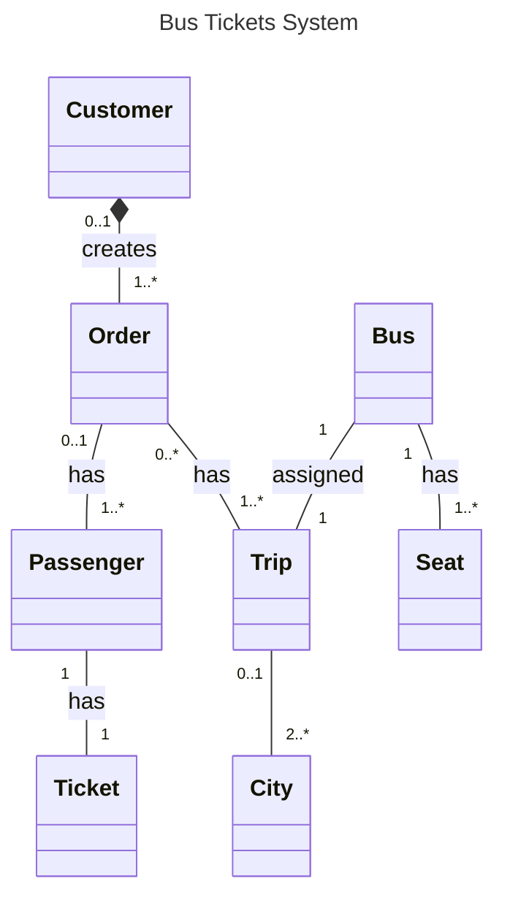

```mermaid
---
title: Bus Tickets System
---
classDiagram
Customer "0..1"*--"1..*" Order: creates
Order "0..1"--"1..*" Passenger: has
Order "0..*"--"1..*" Trip: has

Passenger "1"--"1" Ticket: has

Trip "0..1"--"2..*" City
Bus "1"--"1" Trip: assigned
Bus "1"--"1..*" Seat: has


```