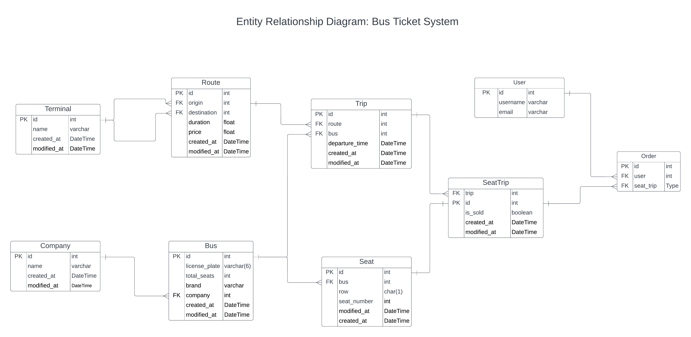

# Proyecto Final Bootcamp de Backend con Python

Nombre: Jose Luis Munoz
Fecha: 30 de Octubre de 2023

## Problema

En la Republica de Panama, para realizar viajes en autobus (servicio de transporte colectivo) desde la Ciudad de Panama hacia el interior del pais, no existe una plataforma para comprar boletos en linea, por lo tanto, se deben comprar en las taquillas del terminal, lo que ocasiona tener que realizar filas para la compra de los boletos.

## Objetivo General

Crear una plataforma de comercio electronico en la que los usuarios puedan adquirir sus boletos de autobus colectivo para viajar desde la Ciudad de Panama hacia el interior del pais.

### Objetivos Especificos

- Disenar una base de datos que represente la solucion planteada para la plataforma de comercio electronico.
- Crear un sitio web utilizando el lenguaje de programacion Python y el web framework Python.
- Construir la interfaz grafica (frontend) del sitio web usando las tecnologias Django Templates, HTMX, Bootstrap y Javascript.
- Realizar pruebas unitarias utilizando las librerias pytest y django-pytest
- Desplegar la aplicacion utilizando las herramientas de docker y docker-compose.

## Requerimientos

- El usuario debe poder buscar segun la terminal de origen, terminal de salida y fecha del viaje los viajes ofertados.
- Se debe poder iniciar sesion, crear usuario y finalizar sesion.
- Los usuarios de tipo administrador debe poder crear, editar y borrar los datos de la tabla "Trips".
- En cada viaje ofertado, el usuario debe poder visualizar

## Diseno de la Base de Datos: Diagrama de Entidad-Relacion

La base de datos consta de 9 entidades:

- Terminal
- Route
- Trip
- User
- Company
- Bus
- Seat
- SeatTrip
- Order

